# Megan Schaefer

Welcome to my personal website! Here you'll find information about my background, projects, and interests.

---

## About Me

I am an undergraduate student in Civil Engineering at the University of Nebraska-Lincoln. My interests lie mostly in the transportation and structural areas of civil engineering.

---

## Skills

- Python  
- Data Visualization (Matplotlib, Seaborn)  
- Data Analysis  
- Markdown
- Project Planning and Scheduling

---

## Projects

### Project 1: Analysis of the Nebraska USEPA SDWIS Database
The goal of this project was to evaluate the drinking water treatment technical capacity across the state of Nebraska for a request for proposal (RFP) from the client, Zenith Data Analysis (not a real client). The client had requested three key analyses: (1) an overall evaluation of the number of violations experienced by each type of water system, (2) a summary of the types of contaminants in drinking water most often in compliance violation by system type, and (3) a detailed evaluation that focused only on small, active community water systems and only considered Maximum Contaminant Level (MCL) violations. The client had also requested a summary table of components (3).

From this project, I learned how to do some basic python functions like importing libraries, reading .CSV files, and some data filtering.
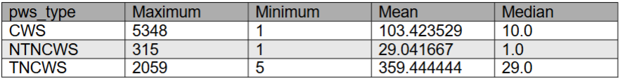

---

### Project 2: Statics Calculations
The goal of our project was to develop a Python code capable of performing standard statics calculations. Our firm (not a real firm) had asked us to include three specific functions in our code: (1) the ability to perform unit conversion and analysis, (2) the ability to handle distributed and point loads acting on static members, and (3) the flexibility to provide consistent calculations in response to variable user inputs. These inputs included load magnitude, location, and angle of application. Our firm had also asked us to provide a summary of our results to our supervisor.

From this project, I learned how to open an image in Python and how to code a math problem that includes and heavily relies on units. We learned how to use the def function to write a resuable block of code for any similar statics problems.
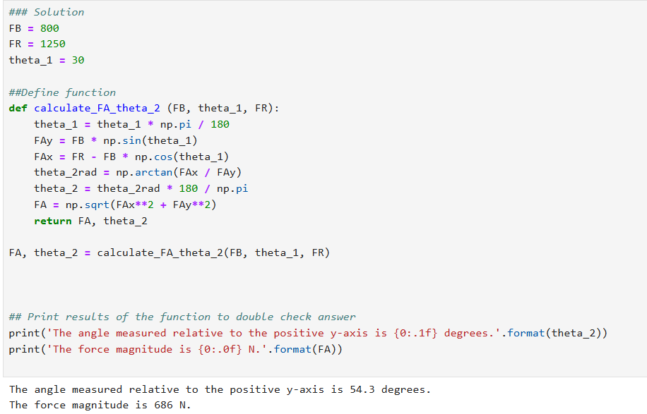

---

### Project 3: Traffic Plots and Analysis
The goal of this project was to take two datasets, one from the National Household Travel Survey (NHTS) and one from the Next Generation Simulation (NGSIM), and organize, analyze, and report on the data. The data analyzed showed how transportation throughout the United States was utilized, and this was done by creating graphs based on data from CSV and Metadata files provided to us. The data provided by this project was be critical for supporting decision-making in future transportation usage/ performance decisions.

The main takeaway from this project was how to visualize our analysis of the data using graphs and charts from the Seaborn and matplotlib.pyplot libraries.
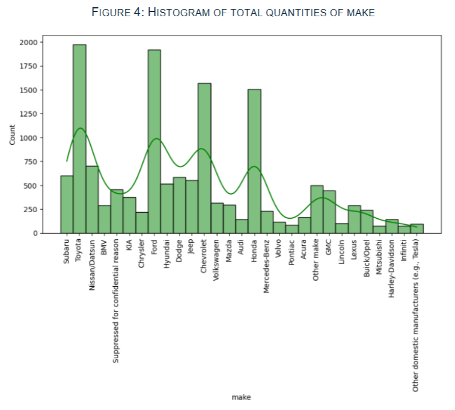
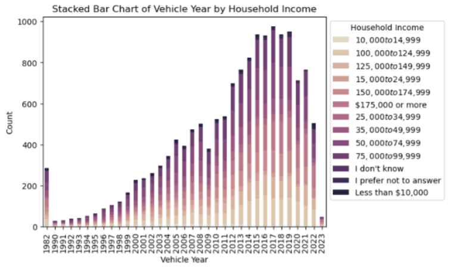
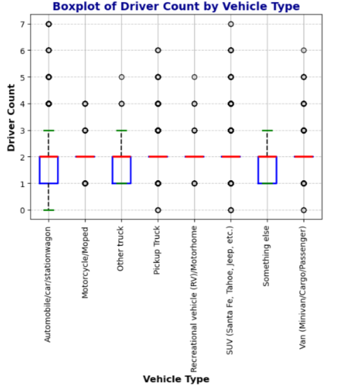
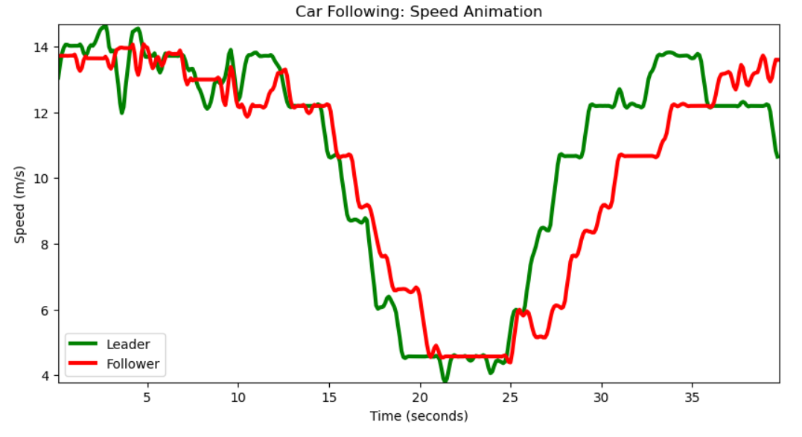

---

### Project 4: Risk Analysis Report: Missouri and Colorado Natural Disaster Risk Comparison
For this analysis, we developed a custom “Risk Score” designed to highlight the relationship between annual event frequency, expected economic impact by specific hazard, and expected overall loss for each county in Missouri and Colorado. Our approach was based on specific fields in the National Risk Index (NRI) and Social Vulnerability Index (SVI) datasets. The analysis involved merging the NRI and SVI datasets using the STCNTY code, calculating both custom and NRI risk scores for each tract, and then aggregating the results by county to better analyze trends across larger areas. We visualized the outcomes using side-by-side bar charts to easily compare the different risk measures.

The biggest thing I learned from this project was how to merge data from two datasets on a specfic column and how to use the .agg functions.
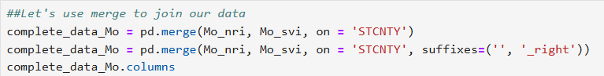
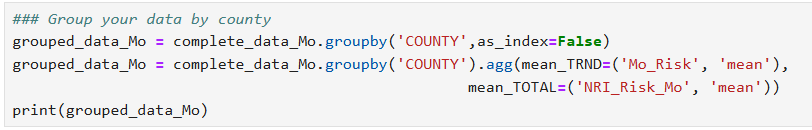
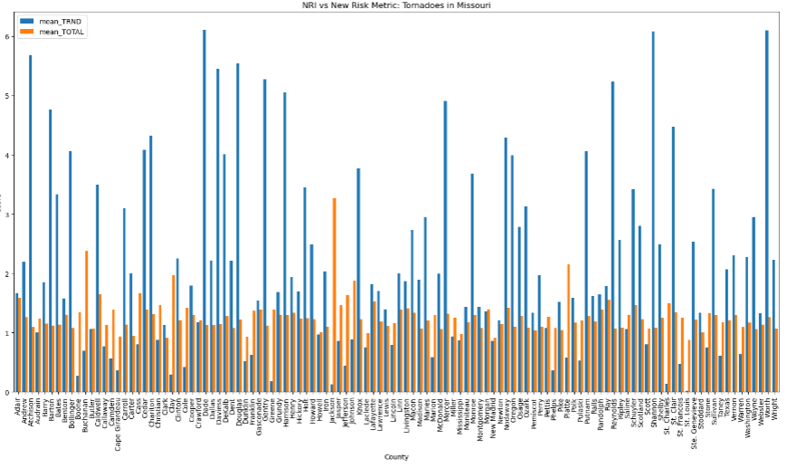
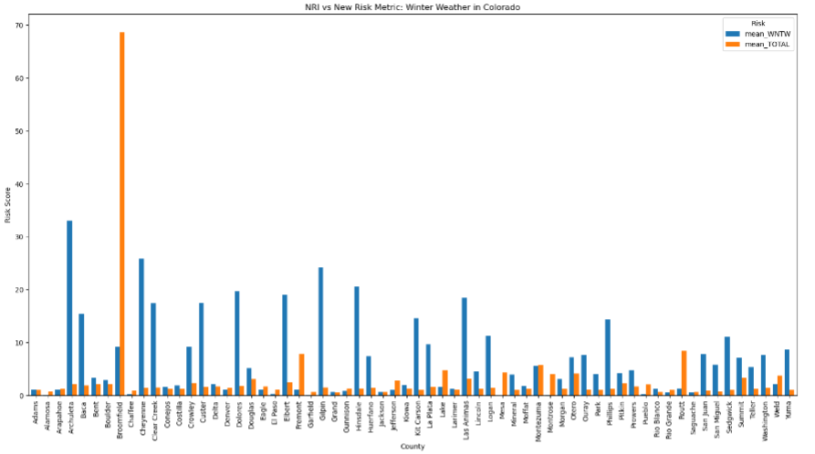

---

### Project 5: Travel Behavior Analysis Using the National Household Travel Survey (NHTS)
The goal of this project is to explore patterns in travel behavior across the Midwest region using the 2022 National Household Travel Survey (NHTS). The findings aim to support evidence-based planning and transportation policy for the Midwestern Departments of Transportation. This analysis will focus exclusively on respondents located in Midwestern states as defined by the NHTS regional coding. The aim is to uncover regional trends and travel behavior patterns that are specific to Midwestern households and communities.

From this project, I learned how to create a chart with "modes".
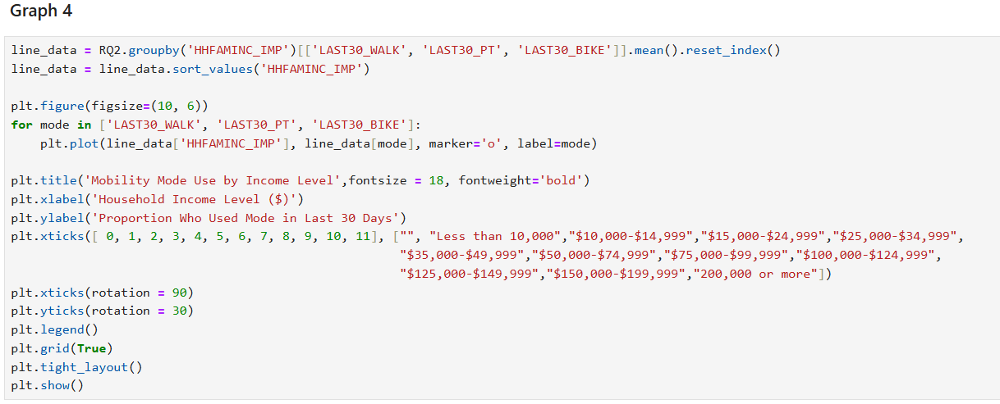
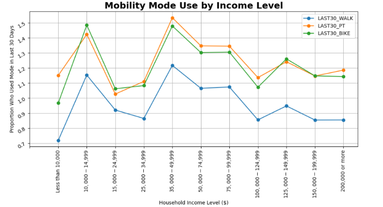
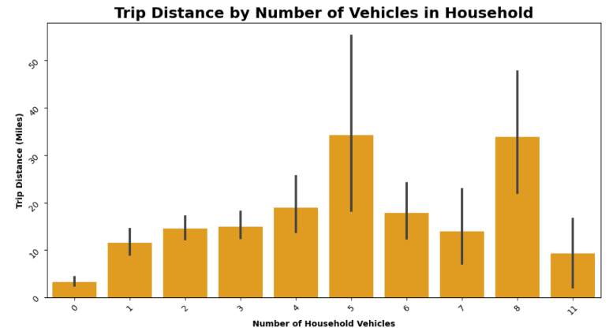
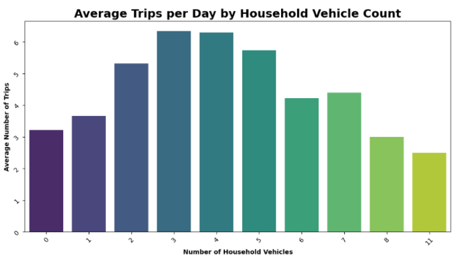
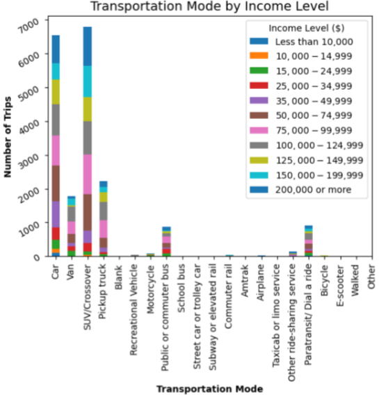

---

## Connect With Me
- [LinkedIn](https://www.linkedin.com/in/megan-n-schaefer)    

## Navigation
- [Home](index.md)  
